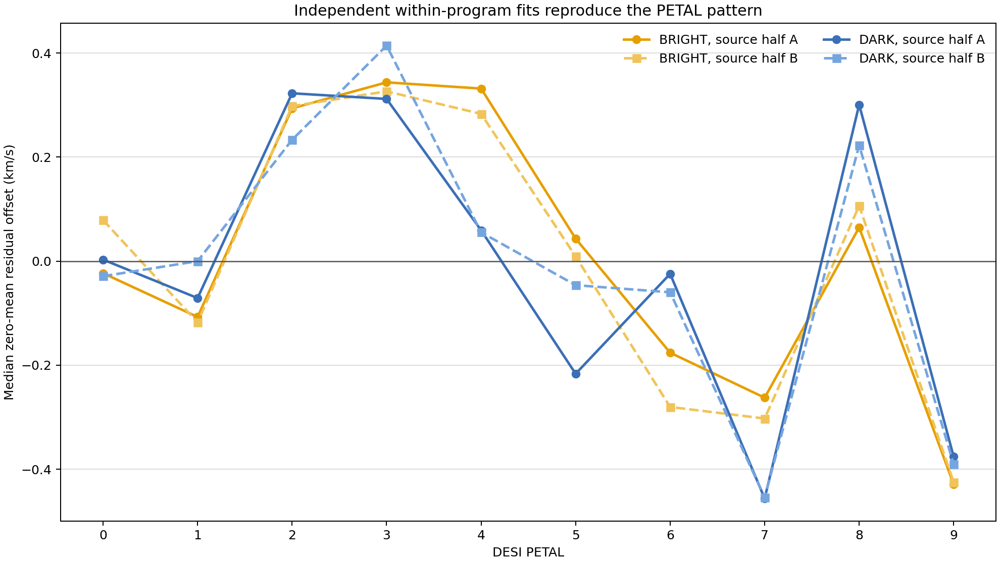

# Три discovery-эксперимента по DESI DR1 RV

Статус: завершено. Это новые результаты внутри данного репозитория и release bundle; литературная новизна отдельно не проверялась.

## Контракт и данные

Гипотезы, primary-метрики, пороги и отрицательные контроли были записаны в `research_plan.json` до строгих независимых fit'ов. После read-only scouting сделаны две явно задокументированные поправки: BRIGHT/DARK зафиксирована как единственная primary-пара E2, а E3 заменён на идентифицируемую нулевую внутри `PROGRAM:NIGHT` PETAL-девиацию.

Полный вход: 7,543,515 эпох, 5,243,675 качественных эпох, 1,736,682 межсуточных пар от 837,638 источников. На всех 7,543,515 FITS-строках `FIBER // 500 == PETAL_LOC`; расхождений: 0.

## Результаты

| Эксперимент | Решение | Главный результат |
|---|---:|---|
| E1: временная память | pass | BRIGHT r=0.3376; DARK r=0.6116; full-pipeline maxT p=0.009901 |
| E2: BRIGHT–DARK coherence | null | r0=0.0100; excess=0.1009; Holm p=0.461400 |
| E3: остаток по PETAL | pass | gain=0.058141 km/s; source-half r=0.8313; p=0.010000 |

### E1 — временная память и смены состояния

Diagnostic PROGRAM:NIGHT offsets retain reproducible, program-conditioned multi-night memory in BRIGHT and DARK.

BRIGHT и DARK прошли одновременно дешёвый maxT-контроль по 9 999 перестановкам, 100 полнопайплайновых exposure-night controls и leave-one-fold-out проверку знака 5/5. BACKUP заранее не был нужен для успеха и остался null. Вторичный CUSUM нашёл ступени около −0.647 km/s (BRIGHT, 2021-10-09→14) и −0.640 km/s (DARK, 2022-01-31→02-02). В post-hoc проверке на независимо fitted source halves агрегат 1–7 дней сохранился: BRIGHT r=0.2556, DARK r=0.6929, оба block p=0.0001. Это program-conditioned временная структура диагностических zero points, совместимая с многодневными состояниями, но не доказательство instrument drift.

### E2 — независимая межпрограммная связь

The apparent BRIGHT/DARK same-night coherence from the joint fit was not reproduced after within-program graph separation and source-disjoint cross-comparison.

Тест использовал только within-program edges и глобально непересекающиеся source halves. В двух зеркальных направлениях минимальное число общих ночей — 122; нижняя 95% граница 14-дневного block-bootstrap для r0 — -0.2523. 9 999 null-перестановок двигали целые 14-дневные блоки DARK одинаково в обеих половинах, сохраняя кратковременную автокорреляцию. Поэтому joint-fit корреляцию около 0.40 нельзя выдавать за физический общий night-state.

### E3 — локализация по PETAL

A source-disjoint transferable PETAL-associated deviation remains after PROGRAM:NIGHT correction.

В пяти outer folds сравнивались `PROGRAM:NIGHT` и `PROGRAM:NIGHT + δ(PROGRAM:NIGHT,PETAL)` на одном и том же holdout support. Порог был 0.02 km/s, требовались 5/5 положительных folds, p≤0.01 и source-half r≥0.50. Выполнено controls: 99. Только гигантская connected component сохраняет mean gain=0.053339 km/s и 5/5 положительных folds. Негейтирующая диагностика разложила gain по within-program парам: BACKUP/BACKUP 0.0710, BRIGHT/BRIGHT 0.0483, DARK/DARK 0.0356 km/s. Отдельные BRIGHT/DARK графы на перекрёстных source halves воспроизвели статический десяти-PETAL рисунок с r=0.8579 и 0.8248; это сильная, но post-hoc локализация.

После завершения controls реальный CV и control #0 были повторены текущим замороженным кодом и cache. Все научные поля совпали с точностью ≤1e-12; timing-колонки намеренно исключены из parity check.

## Что здесь действительно интересного

E1 и E2 вместе разделяют две идеи, которые исходный аудит смешивал: внутри BRIGHT и DARK есть воспроизводимая многодневная память, но общего same-night состояния между независимо оценёнными программами строгий тест не подтвердил. Значит, структура program-conditioned и её нельзя автоматически превращать в глобальный night-state. E3 независимо локализует переносимый остаток по PETAL; его решение нужно читать буквально, не расширяя на нетестированные stellar/tile/exposure модели.



Рисунок — post-hoc диагностика: BRIGHT и DARK оценены в отдельных графах и на перекрёстных непересекающихся половинах источников. Он показывает локализацию, но сам по себе не доказывает аппаратную причинность.

## Ограничения

Все три линии exploratory для DESI DR1: гипотезы появились после знакомства с этим release. Сильное подтверждение потребует untouched release или строго chronological unseen-night prediction. Ни временная связь, ни PETAL-локализация сами по себе не называют конкретную физическую причину.

## Воспроизведение

Из корня репозитория:

```powershell
.\.venv\Scripts\python.exe experiments\2026-07-13_novel_signals\run_all.py --workers 10
```

Машинный источник истины: `claims.jsonl`, `experiment_manifest.json` и CSV рядом с этим отчётом.

QA репозитория на Windows: 37 тестов прошли; 1 базовый тест остаётся Windows-only failure, потому что ожидает 4 LF-байта от `Path.write_text`, который записывает 6 CRLF-байт. Экспериментальные self-tests и `git diff --check` проходят.
