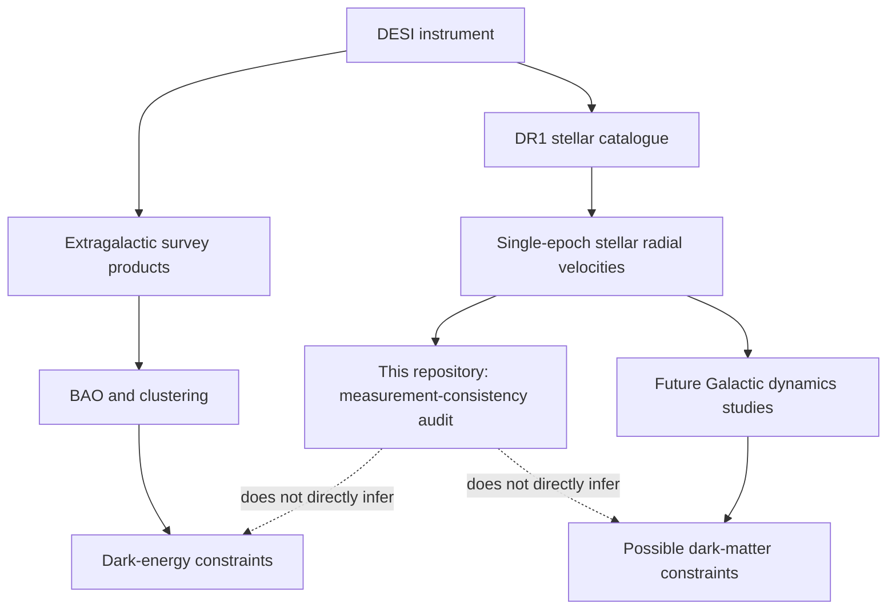

# The Big Picture: One Instrument, Different Scientific Questions

[Start](README.md) -> **The big picture** -> [From light to velocity](02_light_to_velocity.md)

## What DESI is

The Dark Energy Spectroscopic Instrument (DESI) is mounted on the Mayall
telescope and can record thousands of spectra in one exposure. A spectrum is a
measurement of light as a function of wavelength. Different targets and
different analyses use those spectra to answer very different questions.

The word **DESI** therefore names the instrument and collaboration; it does not
by itself tell us whether a particular result is about cosmology, galaxies, or
Milky Way stars. See source
[S-DESI-DR1-STELLAR-PAPER](SOURCES.md#s-desi-dr1-stellar-paper).

## The cosmology branch

For DESI cosmology, distant galaxies and [quasars](GLOSSARY.md#quasar) provide
[redshifts](GLOSSARY.md#redshift). Their large-scale spatial pattern contains
the baryon acoustic oscillation (BAO)
feature, which acts as a statistical standard ruler. Comparing that ruler over
cosmic time constrains the expansion history and dark-energy models. The DESI
DR1 BAO analysis uses galaxy, quasar, and
[Lyman-alpha forest](GLOSSARY.md#lyman-alpha-forest) tracers, not the repeat-star
sample audited here
([S-DESI-DR1-BAO](SOURCES.md#s-desi-dr1-bao)).

```text
distant extragalactic spectra
  -> redshifts
  -> three-dimensional large-scale structure
  -> BAO distance measurements
  -> cosmological parameters and dark-energy constraints
```

That is the route that explains the instrument's name. It is **not** the route
implemented by this repository.

## The Milky Way branch

DESI also observes millions of stars. The Milky Way Survey and the DR1 stellar
value-added catalogue provide radial velocities, atmospheric parameters, and
chemical abundances. The catalogue includes single-epoch measurements and more
than a million stars with repeat measurements, which makes consistency testing
possible. The primary catalogue description is
[S-DESI-DR1-STELLAR-PAPER](SOURCES.md#s-desi-dr1-stellar-paper), and the official
product guide is
[S-DESI-DR1-STELLAR-DOC](SOURCES.md#s-desi-dr1-stellar-doc).

```text
stellar spectra
  -> line-of-sight velocities and stellar properties
  -> Galactic kinematics and population studies
  -> possible later constraints on the Milky Way mass distribution
```

This repository enters between the first and second arrows: it asks whether the
released single-epoch velocities and their uncertainties behave consistently.
It does not build a Galactic dynamical model.

## Where this repository sits



## Programs are observing regimes, not star types

The audit focuses on the DESI `MAIN` survey and three observing programs:

- `BRIGHT`: observations made in bright-time conditions;
- `DARK`: observations made in dark-time conditions;
- `BACKUP`: a backup observing program used under less predictable conditions.

These labels organize observations. They do not mean bright, dark, or backup
*kinds of stars*. A star may appear in more than one program. Program matters
because observing conditions and calibration behavior can differ.

## The exact scope statement

**Claim `SCOPE-STELLAR`:** this repository audits stellar radial-velocity
measurements from the DESI DR1 stellar catalogue.

**Not tested:** cosmological parameters, the dark-energy equation of state, the
Milky Way gravitational potential, or the dark-matter density.

**Why the wider context still matters:** an error in an input measurement can
propagate into later science. Auditing the input is useful precisely because it
protects downstream inference, not because the audit has already performed that
inference.

Next: [How light becomes radial velocity](02_light_to_velocity.md)
