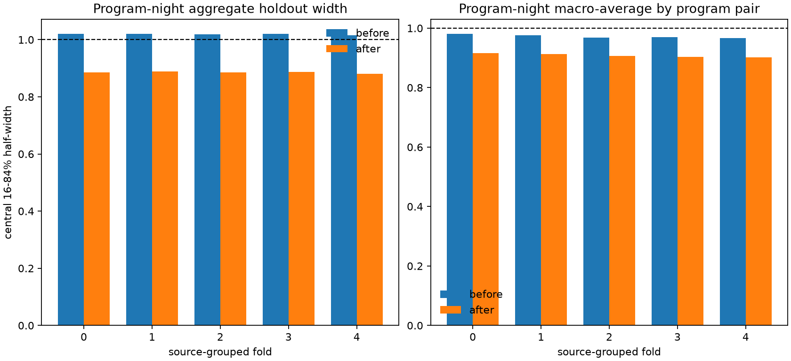

# How the Evidence Tries Not to Fool Itself

[Start](README.md) -> [Why audit?](03_why_audit.md) -> **How evidence works** -> [What we found](05_what_we_found.md)

## The basic problem: flexible patterns can fit accidents

If we give a model a separate offset for many observing nights, it may make the
data used to fit it look better even when no transferable pattern exists. A
credible audit therefore asks more than, "Did the fitted data improve?" It asks:

1. Does the pattern work for different stars?
2. Is it stronger than patterns obtained after the relevant labels are
   deliberately scrambled?
3. How uncertain is the result?
4. Did it meet a decision rule that was declared before the strict test?

The folds, source halves, shuffles, bootstraps, and multiple-testing corrections
answer different parts of that checklist. None of them identifies a physical
cause by itself.

## Source-disjoint folds hold out stars

A [source-disjoint split](GLOSSARY.md#source-disjoint) keeps every measurement
of one physical star on only one side of a train-holdout boundary. In the
five-fold baseline test, the procedure is:

1. assign each source identity to one of five groups;
2. fit `PROGRAM:NIGHT` offsets with four groups;
3. apply those offsets to repeat pairs from the fifth, held-out group;
4. rotate the held-out group until every group has been tested.

This prevents one star's peculiar velocity history from being learned in the
fit and then counted again as independent evidence in the holdout score. The
bars below show that the normalized central width decreases in each held-out
source fold.



The numerical fold results are in the
[baseline summary](../reports/program_night_artifacts/summary.csv).

Five folds are five consistency checks inside one release, not five independent
surveys. Their training sets overlap, so “5/5 positive folds” is useful sign
stability but must not be counted as five independent replications.

### A crucial boundary: these are known nights

The split is disjoint by **source**, not by observing night. Training stars and
holdout stars can have measurements on the same represented nights. The test
therefore asks whether an offset estimated from some stars transfers to
different stars on known nights.

It does **not** ask whether the model can predict the offset of a night absent
from training. In short, the result is out of sample in star identity, but not
an unseen-night forecast.

## Source halves ask whether the offsets can be recovered twice

A second check divides source identities into two non-overlapping halves. The
night-offset model is fitted separately in half A and half B, the arbitrary
zero points are aligned, and offsets for common labels are compared.

For the baseline, the two halves recover 483 common `PROGRAM:NIGHT` labels with
Pearson correlation `r=0.98026` and slope `1.00157`
([replication table](../reports/program_night_artifacts/reproducibility.csv)).
That close agreement makes shared-source leakage and one-off pair noise less
plausible explanations for the pattern.

Source halves still use the same DESI DR1 release, time span, and represented
nights. They are separate fits to disjoint stars, not confirmation on an
untouched release and not prediction of future nights. Correlated calibration,
exposure, and night effects can therefore be shared by both halves; the check
tests source reuse, not independence of every systematic.

## Shuffled controls construct a comparison world

A [permutation control](GLOSSARY.md#permutation-control) deliberately breaks the
association being tested while preserving as much unrelated structure as the
design allows. The same analysis is then run on the shuffled data. This asks,
"How large a result can this pipeline produce when the target association has
been removed?"

The shuffle must match the question:

| Test | Association broken | Structure deliberately retained |
|---|---|---|
| Baseline | Exposure-to-night assignment | The flexible fitting and source-disjoint scoring procedure |
| E1 | Ordering of night offsets; also exposure-night assignment in full-pipeline controls | Night sampling and, in the full-pipeline version, the complete fitting procedure |
| E2 | Alignment of BRIGHT and DARK calendar blocks | Short-range structure inside 14-day blocks and the same shift in both source halves |
| E3 | PETAL assignment within an exposure | Exposure membership and the baseline `PROGRAM:NIGHT` structure |

For the baseline, none of 100 shuffled-night controls matched the real
`0.494756 km/s` robust-width reduction
([control results](../reports/program_night_artifacts/permutation_summary.csv)).
For E3, none of 99 within-exposure PETAL controls matched the real incremental
gain
([PETAL controls](../experiments/2026-07-13_novel_signals/petal_permutations.csv)).

## Why empirical p-values use “add one”

An [empirical p-value](GLOSSARY.md#empirical-p-value) is calculated from the
controls as:

```text
p = (1 + number of controls at least as extreme as the real result)
    / (1 + total number of controls)
```

Adding one avoids reporting an impossible exact zero merely because a finite
control set did not contain a more extreme value. With zero exceedances among
100 controls, the smallest reportable value is `1/101 = 0.009901`. With zero
exceedances among 99 controls, it is `1/100 = 0.01`.

This p-value measures extremeness under the chosen control design. It is not the
probability that the scientific claim is false, the probability that the result
will replicate, or evidence for a particular instrumental cause.

## Bootstrap, maxT, and Holm solve different problems

A [bootstrap](GLOSSARY.md#bootstrap) repeatedly resamples suitable observational
units and recalculates a statistic. Its spread shows how much that statistic
changes across plausible resamples. When neighboring nights may be correlated,
resampling blocks rather than isolated nights better preserves that short-range
structure. E2 uses a 14-day block bootstrap for its correlation interval. A
bootstrap propagates uncertainty from the observations already present; it does
not create new independent data.

When several related statistics are examined, one apparently small p-value can
appear by chance. Two safeguards used here are:

- **maxT:** each control records the largest test statistic across the tested
  family. A real statistic must beat this control maximum, not merely its own
  uncorrected null distribution. E1's full-pipeline result has maxT
  `p=0.009901` for the supported BRIGHT and DARK persistence claim.
- **Holm adjustment:** p-values from a declared family are ordered and adjusted
  with stricter protection for the smallest one. E2's BRIGHT-DARK result has
  Holm-adjusted `p=0.4614`, so it does not support shared same-night coherence.

Bootstrapping describes sampling uncertainty. maxT and Holm protect against
multiple opportunities to obtain a favorable result. They are complementary,
not interchangeable.

## What “pass,” “null,” and “exploratory” mean here

| Label | Meaning in this repository | Meaning it does not have |
|---|---|---|
| `pass` | Every declared gate for this test was met | The explanation is proven, causal, or universally true |
| `null` | The declared test did not support the claim | The underlying quantity is exactly zero under every possible model |
| `exploratory` | The question was developed with prior access to this DESI DR1 release | The result is worthless or unconstrained |

Frozen metrics, gates, source-disjoint evaluation, and negative controls make an
exploratory result more credible. They do not turn a reused release into
untouched confirmatory data. Strong confirmation would use a pre-specified
analysis on a future release, an independent survey or data slice, or a genuine
chronological unseen-night prediction.

Next: [The results, read literally](05_what_we_found.md)
