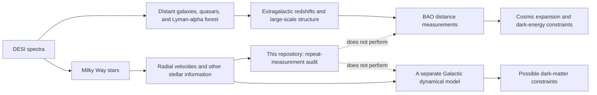

# Where Dark Matter and Dark Energy Fit—and Where They Do Not

[Start](README.md) -> [What we found](05_what_we_found.md) -> **Dark matter and dark energy**

## One instrument, two very different inference routes

The name *Dark Energy Spectroscopic Instrument* makes it reasonable to wonder
whether every DESI analysis measures dark energy. It does not. DESI records
spectra for several kinds of targets, and the scientific conclusion depends on
which targets, measurements, and inference model are used.

In the cosmology branch below, [redshift](GLOSSARY.md#redshift),
[quasar](GLOSSARY.md#quasar), and
[Lyman-alpha forest](GLOSSARY.md#lyman-alpha-forest) are defined in the
glossary; they are extragalactic concepts, not properties of the repeat-star
sample.

The shared instrument is the starting point. The arrows after the spectrum are
what distinguish the science.

## Dark energy: the extragalactic BAO route

[Dark energy](GLOSSARY.md#dark-energy) is the name given to whatever drives the
observed accelerated expansion of the Universe in current cosmological models.
DESI constrains that expansion by mapping distant tracers and measuring baryon
acoustic oscillations (BAO).

BAO is a preferred separation scale left by sound waves in the early Universe.
It acts as a statistical standard ruler. DESI's cosmology analysis uses the
[redshifts](GLOSSARY.md#redshift) and three-dimensional distribution of
galaxies, [quasars](GLOSSARY.md#quasar), and the
[Lyman-alpha forest](GLOSSARY.md#lyman-alpha-forest) to measure that ruler over
cosmic time
([S-DESI-DR1-BAO](SOURCES.md#s-desi-dr1-bao)).

This repository does not follow that route. Its rows are stellar radial
velocities from the DR1 Milky Way catalogue
([S-DESI-DR1-STELLAR-PAPER](SOURCES.md#s-desi-dr1-stellar-paper)). It does not
build an extragalactic redshift map, measure BAO, fit a cosmological likelihood,
or estimate a dark-energy parameter.

**Claim `SCOPE-DARK-ENERGY`:** the BAO route is genuine DESI science, but dark
energy is not directly tested here.

Calibration quality can matter broadly across a survey. That indirect relevance
does not make a stellar repeat-velocity audit a dark-energy measurement.

## Dark matter: the separate stellar-kinematics route

[Dark matter](GLOSSARY.md#dark-matter) is inferred from gravitational effects
that visible matter alone does not explain. In the Milky Way, stellar
kinematics can help constrain the total gravitational field and mass
distribution. Radial velocity supplies one component of a star's motion, so it
can be an important input
([S-DESI-MWS-OVERVIEW](SOURCES.md#s-desi-mws-overview)).

A dark-matter inference requires much more than a collection of radial
velocities. A Galactic dynamics analysis typically combines positions,
distances, motions across the sky, line-of-sight velocities, selection effects,
visible-matter models, and assumptions about how the stellar population moves
in a gravitational potential. It then fits a mass or potential model. The broad
connection between stellar kinematics and local dark-matter inference is
reviewed in
[S-DARK-MATTER-KINEMATICS](SOURCES.md#s-dark-matter-kinematics).

This repository performs none of those mass-model steps. It compares repeat
radial-velocity measurements and asks whether residuals follow observing labels.
It fits no Galactic potential, density profile, mass decomposition, or
dark-matter parameter.

**Claim `SCOPE-DARK-MATTER`:** better-calibrated stellar velocities could be
useful inputs to a future Galactic mass analysis, but this audit is not itself a
dark-matter result.

## A quick way to keep the claims straight

| Statement | Safe? | Why |
|---|---:|---|
| DESI was built in large part for dark-energy cosmology | Yes | Its extragalactic BAO program constrains cosmic expansion |
| The stars in this repository are the BAO tracers | No | The audited sample is the separate DR1 stellar catalogue |
| Stellar velocities can contribute to Galactic dark-matter studies | Yes | They can enter a later kinematic and mass-model inference |
| This repository measures dark matter | No | It contains no Galactic mass or dynamical model |
| This repository tests dark energy | No | It contains no BAO or cosmological-parameter analysis |

## Why the audit still matters

Scientific inference is only as trustworthy as its inputs and uncertainty
model. Finding reproducible measurement-linked residuals can motivate better
calibration tests and protect later analyses. The honest scientific claim ends
there: improving or auditing an input is valuable preparation for downstream
science, not evidence that the downstream quantity has already been measured.

Back to the [explanation home](README.md).
