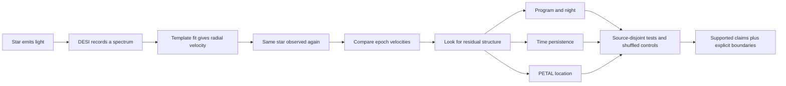

# Understand DESI RV Audit

## The sixty-second version

DESI records spectra: the amount of light received at many wavelengths. The
positions of stellar absorption lines in a spectrum reveal a star's
[radial velocity](GLOSSARY.md#radial-velocity), the component of motion along
our line of sight. DESI observed many stars more than once, so we can ask a
simple quality-control question: **does the same star receive mutually
consistent velocity measurements at different times?**

This repository finds that some remaining measurement differences group by
observing program and night even after a published correction and conservative
uncertainty floors. The pattern transfers to different held-out stars and is
stronger than shuffled-night controls. Follow-up experiments find temporal
persistence within BRIGHT and DARK, do **not** confirm one global same-night
state shared by those programs, and localize a smaller residual by DESI PETAL.

This is a calibration audit. It is not an official DESI correction, not proof
of an instrument fault, and not a direct measurement of dark matter or dark
energy.

## One picture of the whole project

## Choose your route

| Your question | Read this |
|---|---|
| What is DESI, and why are stars inside a dark-energy project? | [The big picture](01_big_picture.md) |
| How does light become a velocity measurement? | [From light to radial velocity](02_light_to_velocity.md) |
| Why compare repeat observations? | [Why audit the catalogue?](03_why_audit.md) |
| What do folds, shuffles, bootstraps, and p-values protect against? | [How the evidence works](04_how_evidence_works.md) |
| What exactly passed, failed, or remains unknown? | [What the project found](05_what_we_found.md) |
| Where do dark matter and dark energy fit? | [Dark matter and dark energy](06_dark_matter_and_dark_energy.md) |
| Show me every claim and its evidence file. | [Evidence map](07_evidence_map.md) |
| Can I inspect the numbers without downloading DESI FITS files? | [Executed notebooks](#executed-notebooks) |
| What does a term mean? | [Glossary](GLOSSARY.md) |
| Which external sources support the scientific background? | [Sources and provenance](SOURCES.md) |
| How can I check my understanding? | [45-minute comprehension check](08_reader_test.md) |

## The four result cards

### BASELINE-NIGHT - pass

**Claim:** a reproducible night-associated residual remains after the published
BACKUP correction and adopted program uncertainty floors. The mean holdout raw
scatter reduction is 0.494756 km/s (13.55%); none of 100 shuffled-night controls
reaches it.

**Boundary:** the model transfers across different stars on represented nights.
It does not predict a new night and does not establish a physical cause.

### E1-TEMPORAL - pass

**Claim:** successive supported BRIGHT and DARK nights separated by 1 to 7
days retain positive temporal persistence in their diagnostic offsets.

**Boundary:** "memory" means autocorrelation in a time series. It does not mean
that a hardware subsystem has been shown to remember anything.

### E2-COHERENCE-NULL - null

**Claim tested:** BRIGHT and DARK share the same calendar-night state after the
program graphs and source halves are separated.

**Outcome:** the strict symmetric correlation is 0.01003 with adjusted
`p=0.4614`. The earlier joint-fit appearance is not reproduced.

**Boundary:** null means this test did not support the claim; it is not proof
that every possible common component is exactly zero.

### E3-PETAL - pass

**Claim:** a smaller PETAL-associated residual transfers to held-out sources
beyond the program-night model: 0.058141 km/s mean incremental gain, 5/5
positive folds, source-half `r=0.83133`, and add-one empirical `p=0.01` from 99
controls.

**Boundary:** association with PETAL is localization, not proof of a
spectrograph fault or of a genuinely night-varying PETAL mechanism.

## Executed notebooks

The notebooks use only compact committed artifacts and contain saved plots and
checks:

- [Baseline evidence: real nights versus shuffled controls](notebooks/01_baseline_evidence.ipynb)
- [Discovery evidence: E1, E2, and E3](notebooks/02_discovery_evidence.ipynb)

No raw DESI FITS download is needed for these two notebooks.

## Critical boundaries

- DESI's cosmology analyses use distant galaxies,
  [quasars](GLOSSARY.md#quasar), and
  [Lyman-alpha forest](GLOSSARY.md#lyman-alpha-forest) tracers, with
  [redshift](GLOSSARY.md#redshift) as a key measurement. This repository uses a
  stellar value-added catalogue.
- Stellar velocities can later support Galactic dark-matter studies, but this
  audit fits no Galactic mass or dark-matter model.
- Screening outliers are not confirmed variable stars or binaries.
- Diagnostic offsets are not proposed catalogue corrections.
- Correlation, temporal persistence, and PETAL association do not identify a
  cause.
- "Pass" means declared gates were met inside this analysis; it does not mean
  established literature novelty.
- The work remains exploratory within DESI DR1.

Next: [The big picture](01_big_picture.md)
