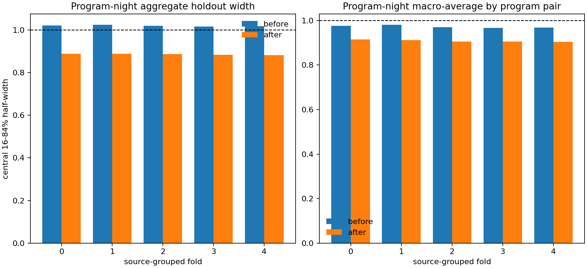

# DESI MAIN Program-Night Audit

## Summary

This is a source-grouped residual diagnostic for public DESI DR1 single-epoch
stellar radial velocities. The audit applies the published backup-program
velocity correction only to `MAIN/BACKUP` rows, applies program-level uncertainty
floors, and then tests whether night-associated residual structure remains in
repeat observations.

Koposov et al. explicitly anticipate night-specific radial-velocity systematics
in DESI DR1. This audit independently quantifies the out-of-sample
night-associated residual component that remains after the published approximate
backup correction.

Supported claim:

> Using source-disjoint cross-validation, the public DESI DR1 MAIN
> repeat-observation sample shows a reproducible night-associated component in
> radial-velocity residuals after the published correction. The effect is
> strongest in `BACKUP / BACKUP`. This analysis does not establish its
> instrumental origin or propose an official correction.

## Reproduction Command

```bash
./scripts/download_main_bundle.sh

/usr/bin/time -l .venv/bin/desi-rv-audit analyze data/desi_main/*.fits \
  --output-dir outputs/desi_main_audit \
  --max-pairs-per-source 20 \
  --lite-output \
  --backup-correction data/desi_corrections/backup_correction.fits \
  --report-output reports/desi_main_audit_report.md \
  --strict-desi-main \
  --plots \
  --program-night-audit \
  --program-night-permutations 20
```

Local run:

- Sources summarized: 5,342,614
- Quality-approved epoch pairs: 2,171,341
- Constant-RV screening outliers: 25,953
- Strict constant-RV screening outliers: 12,141
- Runtime: 1,831.86 s
- Maximum resident set size: 11.66 GiB

The 25,953 outliers and 12,141 strict outliers come from the baseline
constant-RV screening layer before applying the diagnostic `PROGRAM:NIGHT`
model. They are not interpreted as confirmed variable stars and are not used as
evidence for the main program-night result.

## Published Backup Correction

The correction table is applied only when `SURVEY == MAIN` and
`PROGRAM == BACKUP`. TARGETID matches in other programs are counted but not
corrected.

| Statistic | Value |
|---|---:|
| Correction rows | 1,218,152 |
| Unique correction TARGETIDs | 1,218,152 |
| Backup epochs | 2,152,133 |
| Backup epochs matched | 2,152,126 |
| Backup epochs unmatched | 7 |
| Non-backup TARGETID matches, not corrected | 27 |
| Correction MD5 | `f48a4b21b541e94d61f4372f4c555f12` |
| MD5 check | pass |

## Fold-Level Results

Mean over five source-grouped folds:

| Metric | Real before | Real after | Shuffled before | Shuffled after |
|---|---:|---:|---:|---:|
| Raw robust scatter, km/s | 3.651 | 3.157 | 3.654 | 3.496 |
| Normalized central width | 1.019 | 0.885 | 0.936 | 0.899 |
| Macro normalized width by program pair | 0.972 | 0.909 | 0.927 | 0.915 |
| `|z| > 3` | 0.051 | 0.040 | 0.043 | 0.038 |
| `|z| > 5` | 0.022 | 0.020 | 0.018 | 0.017 |
| Mean Gaussian pair loss | 4.358 | 4.160 | 4.052 | 3.981 |

The real `PROGRAM:NIGHT` model reduces holdout raw robust scatter by
0.495 km/s, or 13.5%. Coarse exposure-level shuffled-night controls reduce raw
scatter by 0.158 km/s on average, or 4.3%. Across 20 permutations, shuffled
improvement ranges from 0.096 to 0.234 km/s; no shuffled permutation reaches
the real improvement. With only 20 permutations, this is a coarse negative
control rather than a strong formal significance claim.



## Program Pair Means

Mean over five folds:

| Program pair | N holdout total | Raw before | Raw after | Reduction | Width before | Width after |
|---|---:|---:|---:|---:|---:|---:|
| `BACKUP / BACKUP` | 996,012 | 3.663 | 2.943 | 19.7% | 1.081 | 0.871 |
| `BACKUP / BRIGHT` | 220,788 | 3.723 | 3.610 | 3.0% | 0.946 | 0.917 |
| `BACKUP / DARK` | 27,683 | 5.584 | 5.460 | 2.2% | 0.959 | 0.934 |
| `BRIGHT / BRIGHT` | 251,116 | 2.906 | 2.781 | 4.3% | 0.893 | 0.855 |
| `BRIGHT / DARK` | 118,127 | 4.396 | 4.169 | 5.2% | 0.996 | 0.935 |
| `DARK / DARK` | 116,420 | 3.494 | 3.426 | 1.9% | 0.960 | 0.939 |

## Graph and Solver Diagnostics

Mean over folds:

- Connected components: 2
- Largest component label fraction: 0.996
- Largest component pair fraction: 0.998
- Holdout pairs scored in the same train component: 346,029 per fold
- Holdout pairs crossing train components and excluded: 1,307 per fold
- `LSQR_ISTOP`: 2 in all folds
- Mean `LSQR_ACOND`: 737
- Mean `LSQR_R1NORM`: 778
- Mean `LSQR_ARNORM`: 0.0036
- Gaia-grouped program-night pairs: 99.93%

Offsets are centered within connected components and are interpreted only as
diagnostic zero-point terms.

The split is source-disjoint, not night-disjoint. The model estimates offsets
for nights represented by the training stars and evaluates those offsets on
different stars observed on the same nights. It therefore tests transfer across
sources for known nights, not extrapolation to unseen nights.

## Independent-Half Reproducibility

Independent source halves recover 484 common `PROGRAM:NIGHT` labels after
component and gauge alignment:

- Offset correlation: 0.980
- Slope B on A: 0.994
- Median absolute difference: 0.096 km/s
- Robust width of offset differences: 0.174 km/s

This is the main check against shared-source leakage or pair-row noise reuse.

This is an exploratory analysis developed iteratively on the public MAIN DR1
sample. Source-grouped folds prevent source reuse within each evaluation, but
the overall workflow was not pre-registered and has not yet been confirmed on a
fully untouched data set. Confirmation would require a pre-specified analysis on
an independent survey, data slice, or future release.

## Pair-Cap Sensitivity

| Max pairs/source | Program-night pairs | Raw before | Raw after | Reduction | Backup/backup reduction | Offset r |
|---:|---:|---:|---:|---:|---:|---:|
| 10 | 1,694,555 | 3.639 | 3.137 | 13.8% | 0.724 km/s | 0.981 |
| 20 | 1,736,682 | 3.651 | 3.157 | 13.5% | 0.720 km/s | 0.980 |
| 50 | 1,752,357 | 3.654 | 3.160 | 13.5% | 0.720 km/s | 0.980 |

## Boundaries

This audit supports:

- a source-grouped out-of-sample residual diagnostic;
- a reproducible night-associated residual component after published
  correction;
- strongest evidence in `BACKUP / BACKUP`;
- compact artifacts that can be independently inspected.

This audit does not prove:

- that the offsets should be applied to the public catalogue;
- that the effect has a specific instrumental cause;
- that heavy tails are astrophysical variability;
- that this is an official DESI correction.

## Artifacts

- `reports/desi_main_audit_report.md`
- `reports/program_night_artifacts/summary.csv`
- `reports/program_night_artifacts/by_program.csv`
- `reports/program_night_artifacts/diagnostic_offsets_program_night.csv`
- `reports/program_night_artifacts/reproducibility.csv`
- `reports/program_night_artifacts/permutation_summary.csv`
- `reports/program_night_artifacts/pair_cap_sensitivity.csv`
- `reports/program_night_artifacts/correction_summary.csv`
- `reports/program_night_artifacts/source_fold_widths.png`
- `reports/program_night_artifacts/run_manifest.json`
